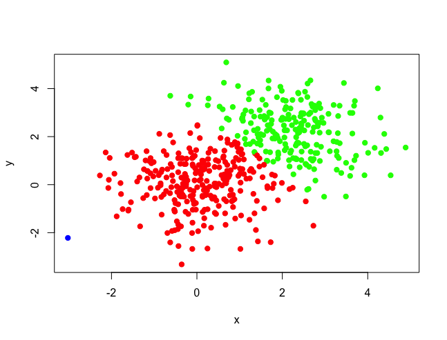

<section id="table-of-contents" class="toc">
  <header>
    <h3>Overview</h3>
  </header>
<div id="drawer" markdown="1">
*  Auto generated table of contents
{:toc}
</div>
</section><!-- /#table-of-contents -->

> ⚠️ **非专业人士整理，仅供参考**

## MeanShift 聚类算法

1. 算法原理

    - [知乎-专栏 机器学习-Mean Shift聚类算法](https://zhuanlan.zhihu.com/p/81629406)
    - [知乎-问答 均值偏移（ mean shift ）？](https://www.zhihu.com/question/67943169) ~~用通俗的语言解释了一下均值偏移（mean shift）(误)~~

2. R package

    - [meanShift: Mean shift classification](https://rdrr.io/cran/meanShiftR/man/meanShift.html) 参数、返回值、样例齐全

    - 简单测试如下

    ```R
    library(meanShiftR)

    set.seed(100)
    # set the number of iterations to test 
    # (we will terminate well before this)
    iter <- 10000
    # set the number of points to simulate
    n <- 500
    # set the bandwidth
    h <- c(0.5,0.5)
    # create example data
    x1 <- matrix( rnorm( n ),ncol=2)
    x2 <- matrix( rnorm( n ),ncol=2) + 2
    x <- rbind( x1, x2 )
    #plot initial points
    plot(x, col=rep(c('red','green'),each=n/2),
        cex=2, xlab='x',ylab='y',pch=20)

    run.time <- proc.time()
    result <- meanShift(
                        x,
                        x,
                        bandwidth=h,
                        alpha=0,
                        iterations = iter)
    meanShiftR_runtime <- (proc.time()-run.time)[3]
    # assignment
    meanShiftR_assignment <- result$assignment
    # value
    meanShiftR_value <- result$value

    plot(x, col=sapply(meanShiftR_assignment,function(x)c('red','green','blue')[x]),
        cex=1.5, xlab='x',ylab='y',pch=20)
    ```

    测试结果

    

## GMM 高斯混合模型

1. 算法原理

    - [知乎-专栏 高斯混合模型与EM算法的数学原理及应用实例](https://zhuanlan.zhihu.com/p/67107370)

    - 可能更易懂一点的EM算法解释 [Introduction to EM: Gaussian Mixture Models](https://stephens999.github.io/fiveMinuteStats/intro_to_em.html) ~~他的 `blog` 比我的好看😅~~

2. R package

    - [EM算法的R实现和高斯混合模型](https://www.r-bloggers.com/lang/chinese/1111#google_vignette) 试了好多 `library` 最后还是 `mclust` 最完善

    - [mclust 文档 P38](https://cran.r-project.org/web/packages/mclust/mclust.pdf) 需要获得每个 `mean` 位置的概率密度值，google 没找着，还是直接查文档靠谱
