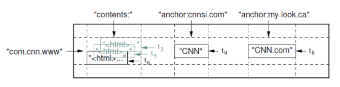
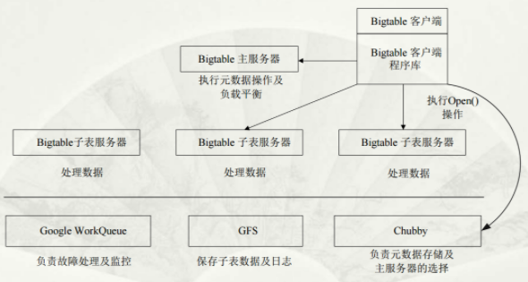

<section id="table-of-contents" class="toc">
  <header>
    <h3>Overview</h3>
  </header>
<div id="drawer" markdown="1">
*  Auto generated table of contents
{:toc}
</div>
</section><!-- /#table-of-contents -->

## BigTable

> `percolator` 的设计基于 `BigTable` 实现，故在此简单介绍 `BigTable` 的架构，详细可参考 [论文-中文译](https://arthurchiao.art/blog/google-bigtable-zh/)

### 数据存储的逻辑格式

一个 `Bigtable` 就是一个稀疏、分布式、持久的多维有序映射表(map)，数据通过行键、列键和一个时间戳进行索引，表中的每个数据项都是不作理解(指 `Bigtable` 本身不存储数据的任何语义)的字节数组。

> 映射关系：(row:string, column:string, time:int64) -> string



以 `Google` 的 `Webtable` 为例：

- row: URL
- columns: contents: 网页内容
- column family: anchor，网页链接锚点文本
- ti: 时间戳

### 基本架构



在 `BigTable` 系统中的主要组件以及概念：

- master server(负责负载均衡): 

    1. 负责新 `tablet` 的分配
    2. 监控 `tablet server` 的状态
    3. 处理来自 `tablet server` 的 `split` 请求

- tablet server:

    1. 处理来自 `client` 的读写请求
    2. 发起 `tablet` 的分裂与合并

- Chubby:

    1. 在 `master server` 的启动阶段，通过分布式锁选出一个唯一的 `master server`
    2. 可用于查找某个 `tablet` 的位置(哪个 `tablet server` 上分配了指定的 `tablet`)
    3. 访问控制元数据
    4. 帮助 `master server` 跟踪 `tablet server`，诸如发现新 `server` 以及挂掉的 `server` 等等，集群可扩展

## Percolator

`Percolator` 在 `BigTable` 的基础上实现，相较于 `BigTable` 来说，`Percolator` 主要延伸出了如下新的特性：

- 多行事务：保证 `snapshot isolation` 隔离级别的多行事务模型
- 观察者框架：当用户指定的列发生变化时，系统调用的代码段

### 数据样式

因为 `Percolator` 基于 `BigTable` 实现，所以在数据样式或者说数据的逻辑存储结构上直接利用了 `BigTable` 的多维映射表结构。

对于每一个 `BigTable` 当中的 row，`Percolator` 将需要的元数据作为一个新的 column 组织到了 `BigTable` 当中，column 定义如下：

|  *Column*  |  *Use*  |
|:------------:|:---------:|
| **c:lock** | An uncommitted txn is writing this cell; contains the location of primary lock |
| **c:write** | Committed data present; Stores the BigTable timestamp of the data |
| **c:data** | Stores the data itself |
| **c:notify** | Hint: observers may need to run |
| **c:ack_O** | observer "O" has run; stores start timestamp of successful last run |

- `notify` 表示是否需要触发在某些列上监听的 `observers`
- `ack` 是一个简单的时间戳值，表示最近执行通知的观察者的开始时间
- `data` kv 数据，key是时间戳，value是真实数据，包含多个entry
- `write` KV结构，key是事务 `commit` 时间戳，value是各个时间戳下曾经写入的值
- `lock` KV结构，key是事务 `start` 时间戳，value是锁的内容

### Percolator 事务

#### 目标

- 锁必须持久化防止一个锁在两阶段提交之间消失，导致提交冲突的事务 --> **冗余备份**
- 锁服务需要高吞吐量 --> **分布式**
- 锁服务需要低延迟 --> **负载均衡**

而以 `BigTable` 为基础，以上几点基本可以满足，所以在 `percolator` 中的实现就是将锁和数据存储在同一行，锁成为了一个特殊的数据列，`percolator` 在一个 `BigTable` 的行事务中对锁列进行读取和修改。

#### Txn Code

```c++
class Transaction {
    struct Write{ Row row; Column col; string value;};
    vector<Write> writes_;
    int start_ts_;

    Transaction():start_ts_(oracle.GetTimestamp()) {}
    void Set(Write w) {writes_.push_back(w);}
    bool Get(Row row, Column c, string* value) {
        while(true) {
            bigtable::Txn T = bigtable::StartRowTransaction(row);
            // Check for locks that signal concurrent writes.
            if (T.Read(row, c+"locks", [0, start_ts_])) {
                // There is a pending lock; try to clean it and wait
                BackoffAndMaybeCleanupLock(row, c);
                continue;
            }
        }

        // Find the latest write below our start_timestamp.
        latest_write = T.Read(row, c+"write", [0, start_ts_]);
        if(!latest_write.found()) return false; // no data
        int data_ts = latest_write.start_timestamp();
        *value = T.Read(row, c+"data", [data_ts, data_ts]);
        return true;
    }
    // prewrite tries to lock cell w, returning false in case of conflict.
    bool Prewrite(Write w, Write primary) {
        Column c = w.col;
        bigtable::Txn T = bigtable::StartRowTransaction(w.row);

        // abort on writes after our start timestamp ...
        if (T.Read(w.row, c+"write", [start_ts_, max])) return false;
        // ... or locks at any timestamp.
        if (T.Read(w.row, c+"lock", [0, max])) return false;

        T.Write(w.row, c+"data", start_ts_, w.value);
        T.Write(w.row, c+"lock", start_ts_, 
            {primary.row, primary.col});  // The primary's location.
        return T.Commit();
    }
    bool Commit() {
        Write primary = write_[0];
        vector<Write> secondaries(write_.begin() + 1, write_.end());
        if (!Prewrite(primary, primary)) return false;
        for (Write w : secondaries)
            if (!Prewrite(w, primary)) return false;

        int commit_ts = oracle.GetTimestamp();

        // Commit primary first.
        Write p = primary;
        bigtable::Txn T = bigtable::StartRowTransaction(p.row);
        if (!T.Read(p.row, p.col+"lock", [start_ts_, start_ts_]))
            return false; // aborted while working
        T.Write(p.row, p.col+"write", commit_ts,
            start_ts_); // Pointer to data written at start_ts_
        T.Erase(p.row, p.col+"lock", commit_ts);
        if(!T.Commit()) return false;  // commit point

        // Second phase: write our write records for secondary cells.
        for (Write w:secondaries) {
            bigtable::write(w.row, w.col+"write", commit_ts, start_ts_);
            bigtable::Erase(w.row, w.col+"lock", commit_ts);
        }
        return true;
    }
}; // class Transaction
```

- Txn Initialize

    初始化一个事务首先会通过 `oracle` 获得一个全局的 `start_ts_` 的事务开始时间戳

- Txn Get

    > `Txn::Get` 的实现基于了 `BigTable` 的行事务

    1. 利用 `BigTable` 的行事务读取指定 row 的 `"c" column family` 下的 `lock` 列，检查在 `[0, starts_ts_]` 之间是否存在着锁记录 

    > 存在未清除的 `[0, starts_ts_]` 锁记录，说明还有事务正在对指定的行进行修改，此时如果允许当前事务读取，则会出现 `读脏` 问题，此时事务隔离级别仅为 `read uncommitted`(数据隔离级别相关可参考[隔离级别、SI 和 SSI（四种隔离级别和快照隔离）](https://blog.csdn.net/songchuwang1868/article/details/97630005))

    2. 通过 `write` 列查找 `[0, starts_ts_]` 范围内最新的记录，能够获得 `data` 的时间戳(写入该 `data` 的事务的 `start_ts`)

    3. 利用时间戳在 `data` 列中完成查找，得到 `value`

- Txn Prewrite (Commit 第一阶段)

    试图锁住所有被写的 `cell` (可以理解为 `Table` 中的单元格)， 事务通过每一个被锁的 `cell` 上的元数据来判断事务之间的冲突

    1. 检查 `Write` 指定的行的 `write` 列，如果有时间戳大于自己的事务记录，abort

    > 发现 `write` 列的记录的时间戳（`commit_ts`）大于自己的 `start_ts_`，说明已经有事务更新了版本，当前的事务的版本已经过时了，所以需要 abort。

    2. 检查 `lock` 列是否加锁，如果已加锁，abort

    > 注意和 `Txn::Get` 不同的是，在写部分的事务中，`lock` 时间戳的检查范围是 `[0, max]` 而不再是 `[0, start_ts_]`。这是因为在 `Get` 的时候读取到特定版本的数据即可，所以在 `start_ts_` 之后发生的状态更新完全不用在意；而对写事务来说，在 `[start_ts_, max]` 之间的成功加锁的其他事务都和自己存在着冲突，所以后加锁的 abort，但是在 `[0, start_ts_]` 之间加锁成功的事务，在第一步中已经排除了其 `commit_ts` 大于 `start_ts_` 的可能，所以可能是该事务在成功提交后因为某些原因尚未释放掉 `lock`，在 `Percolator` 的实现中为了保险起见还是 abort 了当前事务

    3. 在 `data` 列写入 <key, start_ts_, value>，`lock` 列写入 <key, start_ts_, primary_pos>

- Txn Commit (Commit 第二阶段)

    1. 通过 `oracle` 服务获得 `commit_ts_` 时间戳

    2. 针对 `primary Write` 检查 `lock` 列是否存在 `start_ts_` 的条目，即检查 `primary Write` 是否加锁成功

    3. 对每一个 `Write` 在 `write` 列写入 <key, commit_ts, start_ts>，删除在 `Prewrite` 阶段对 `lock` 列的修改

> 图解版——>[Google Percolator 的事务模型](https://andremouche.github.io/transaction/percolator.html)

#### 锁清理 & Primary Key

有趣的是，在 Commit 的第一阶段 `Prewrite` 中，一个事务需要修改的 key 集合中的一个 key 失败并不会清除之前处理的 key (如 `primary key`...) 添加的 `lock` 列的修改。

针对上述问题，在 `Percolator` 当中采用的策略是惰性清理：在 `Txn B` 发现 `Txn A` 遗弃的锁时，`Txn B` 通过一定的方式确认 `Txn A` 确实是遭遇了不测，就会在事务提交的过程中顺便清理掉 `Txn A` 留下的锁。

但是 `Txn B` 判断 `Txn A` 是否失败是困难的。不过依靠 `Primary key` 可以有效地做到这一点，

考虑执行 `Txn A` 的事务在不同的时间节点发生崩溃：

1. `Prewrite` 阶段：此时可能已经写入 `Primary key` 的 `lock` 列，并写了部分 `Secondary key` 的 `lock` 列

    > 这个情况下，`Txn B` 访问到保存遗弃锁的 row 时，能直接或间接地找到 `Txn A` 的 `Primary Key`，此时应对 `Txn B` 进行 rollback 操作（因为 `Primary Key` 总是最先被提交，如果提交就会清理 `Primary Key` 的 lock 列，依然能够读取到说明 `Txn A` 不曾提交，回滚是合理的）

2. `Commit` 阶段：`Primary key` 已清除 lock 列，但部分 `Secondary key` 尚未被清理

    > 这种情况就是部分提交，`Txn B` 需要对 `Txn A` 进行 roll forward 操作

但是还存在着一个问题：一个执行较慢的 `Txn A` 可能会被 `Txn B` 回滚掉（roll forward 情况也会出现，不过因为 `BigTable` 的行事务是原子的，所以并不会出现错误，最多就是 `Txn B` 帮忙完成了 `Txn A` 的**部分任务**），回滚掉的话对用户来说会明显增加请求响应的尾延迟

解决上述问题的关键是**确定一个事务请求是否是活跃的**，`Percolator` 的解决办法是利用 `Chubby` + `wall time` (可以理解为是一种租期方法)。

运行中的 worker 会写一个 `token` 到 `Chubby` 锁服务来指示他们属于本系统，`token` 会被其他 worker 视为一个代表活跃度的信号（当处理退出时token会被自动删除）。另外，一个锁的 `wall time` 如果太老，即使token有效也会被清理。特别的，有些操作运行很长时间才会提交，针对这种情况，在整个提交过程中 worker 会周期的更新 `wall time` 。