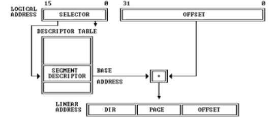
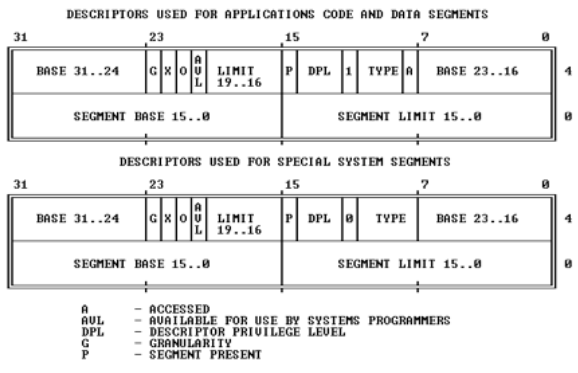

<section id="table-of-contents" class="toc">
  <header>
    <h3>Overview</h3>
  </header>
<div id="drawer" markdown="1">
*  Auto generated table of contents
{:toc}
</div>
</section><!-- /#table-of-contents -->

# OS boot

## BIOS 启动过程

`Intel 80386` 体系架构下，在计算机启动后，CS : IP 寄存器设置为 0xf000 : 0xffff (即物理地址 0xfffff 处开始执行)，在这里仅仅只是一个跳转指令，跳转到 `BIOS` 例行程序的执行点。

`BIOS` 进行硬件自检和初始化后，会选择一个启动设备 （通常为外存储设备），读取其第一个扇区（512B）到内存 `0x7c00` 处，这部分代码就是一个 OS 的 `bootloader`。

接着，剩下的任务就交给了 `bootloader`。

## Bootloader 操作流程

### 主要任务

- 开启保护模式，启用分段机制（虚拟地址-->线性地址）
- 从磁盘读取 ELF 格式的 kernel 到内存
- 显示字符串信息
- 操作权交给 kernel

### 实模式

在 `Bootloader` 开始工作的时候，计算机系统处于实模式状态。在 i386 架构下，此模式下，物理空间被分为多个段，程序的数据段和代码段处于不同的段内，有效寻址空间为 1MB（2^20）。

有趣的是，在实模式下 CPU 的数据处理位宽是16位，即16位的工作模式，这点是和 8086 CPU兼容的。用16位数据处理能力寻址20位的地址空间的方式就是分段的方式，地址格式为

> segment : offset 即 segment << 4 + offset

不过 segment << 4 + offset 最大值显然可以超过 1MB，只不过超过情况下发生了地址回卷，即对1MB取模。

但是，在之后的架构中，由于数据处理位宽、地址线宽的提升，这样在发生地址超过1MB的时候就无需发生回卷了。这就会导致新架构对 8086 架构不兼容，为了实现兼容，所以在新计算机结构中，引入了 A20 Gate 来模仿出地址回卷的情况。

#### A20 Gate

A20 Gate 说白了其实就是第 20 位地址线，为了简单地实现兼容，将第 20 位地址线和键盘控制器的一个输出进行了 AND 操作，这样就保证了在系统初启的时候，A20 整体输出是一个低电平。

那么所谓的打开 A20 Gate，其实就是向键盘控制器发送一个指令将该输出变为一个高电平。

`8042 键盘控制器` 的输入输出缓冲为 0x60 和 0x64，0x64 是指令、0x60 是输入参数以及输出缓冲，该控制器的 A20 使能端口在 P2 输出端口的位1上

### 保护模式

- 可寻址 4GB 物理或者线性空间
- 访问 64TB 的虚拟地址空间（2^14 个段，每个段 4GB）

#### GDT & LDT

全局描述表 和 局部描述表，每个段表包含 2^13 个段，虚拟地址空间64TB就是这么来的，不过需要注意的是在未建立分页的虚拟地址映射之前，这 2^14 个段的地址空间很大程度上是重叠的，目前并没有实际意义。

分段地址转换的流程如下：



首先通过端选择子（`SELECTOR`）索引段描述符表，在描述符表当中存储的就是一个个段描述符，`ucore` 中对段描述符的定义如下：

> kern/mm/mmu.h

```c
/* segment descriptors */
struct segdesc {
    unsigned sd_lim_15_0 : 16;        // low bits of segment limit
    unsigned sd_base_15_0 : 16;        // low bits of segment base address
    unsigned sd_base_23_16 : 8;        // middle bits of segment base address
    unsigned sd_type : 4;            // segment type (see STS_ constants)
    unsigned sd_s : 1;                // 0 = system, 1 = application
    unsigned sd_dpl : 2;            // descriptor Privilege Level
    unsigned sd_p : 1;                // present
    unsigned sd_lim_19_16 : 4;        // high bits of segment limit
    unsigned sd_avl : 1;            // unused (available for software use)
    unsigned sd_rsv1 : 1;            // reserved
    unsigned sd_db : 1;                // 0 = 16-bit segment, 1 = 32-bit segment
    unsigned sd_g : 1;                // granularity: limit scaled by 4K when set
    unsigned sd_base_31_24 : 8;        // high bits of segment base address
};
```

上述代码对应的段描述符图示如下：



各个字段的定义如下：

- sd_base：线性地址空间当中的段的起始地址，32位
- sd_limit：段的大小，20位，字节或者4K为单位
- 属性：
    - sd_type：段类型，代码段、数据段等等
    - sd_dpl：特权级别，实现保护机制
    - sd_s：标识系统的段描述符和应用的段描述符
    - sd_g：粒度，即段的大小时以字节还是4K为单位

在段选择子中并不是简单地记录了需要访问的段描述符的索引号，同时还包含了2位的请求特权级（`RPL`），标识请求者的特权级，需要与段描述符中的 `DPL` 进行比较，特权级应当不比 `DPL` 低才能安全访问；还有1位的表指示位，0表示 GDT，反之为 LDT（在 `ucore` 当中仅使用 GDT）

`ucore` 中的 GDT 表定义及其数据如下：

> kern/mm/pmm.c

```c
static struct segdesc gdt[] = {
    SEG_NULL,
    [SEG_KTEXT] = SEG(STA_X | STA_R, 0x0, 0xFFFFFFFF, DPL_KERNEL),
    [SEG_KDATA] = SEG(STA_W, 0x0, 0xFFFFFFFF, DPL_KERNEL),
    [SEG_UTEXT] = SEG(STA_X | STA_R, 0x0, 0xFFFFFFFF, DPL_USER),
    [SEG_UDATA] = SEG(STA_W, 0x0, 0xFFFFFFFF, DPL_USER),
    [SEG_TSS]    = SEG_NULL,
};
```

> Note: 上述定义的段的粒度均以 `4KB` 为单位

> boot/bootasm.S

```asm
.p2align 2                                          # force 4 byte alignment
gdt:
    SEG_NULLASM                                     # null seg
    SEG_ASM(STA_X|STA_R, 0x0, 0xffffffff)           # code seg for bootloader and kernel
    SEG_ASM(STA_W, 0x0, 0xffffffff)                 # data seg for bootloader and kernel
```

> 这部分段描述符表是在开启保护模式之前设置的

### Bootloader 流程梳理

梳理了前面的前置知识之后，回到 `Bootloader` 的工作流程上：

- bootasm.S
    - 关中断、开启 `A20 Gate`
    - 将简易的 `GDT` 的基地址与表大小通过 `lgdt` 写入到 `GDTR` 寄存器当中
    - 设置 `CR0` 寄存器的 `Protected Enable` 位，开启分段机制，对各个数据段的访问将接受特权级检查，如不满足则触发 General Exception 中断（不过此时中断使能还没开启哦）
    - 跳转到32位代码（设置 `CS` 寄存器）
    - /////////////////进入保护模式/////////////////////
    - 设置 `DS`、`ES`、`FS`、`GS`、`SS` 为内核数据段
    - 设置堆栈指针寄存器 `ESP` 以及堆栈基址寄存器 `EBP`，在 `ucore` 中目前的堆栈实地址范围为 `[0, 0x7c00]`（即 `bootloader` 代码的低空间）
    - 进入 bootmain 函数（C code）
- bootmain.c
    - 先从磁盘第一个扇区开始读入 4KB 大小，这部分包含了 `ELF` 头信息（`elfhdr`），其中比较重要的字段为：
        - e_magic：标识这是个 elf 文件
        - e_entry：可执行程序的入口点
        - e_phoff：`program hdrs` 的偏移
        - e_phnum：# of `program hdr`
    - 对于每一个 `program hdr`，记录了程序的每个段应该在内存中如何装载：
        - p_va：需要装载到的虚拟地址位置
        - p_memsz：装载到内存中的大小
        - p_offset：段在elf中的偏移
    - 进入入口点执行
    - /////////////////进入内核代码///////////////////

至此，`boot` 流程完成，即将开始内核初始化。。。