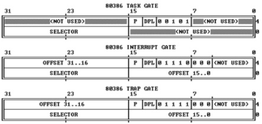

<section id="table-of-contents" class="toc">
  <header>
    <h3>Overview</h3>
  </header>
<div id="drawer" markdown="1">
*  Auto generated table of contents
{:toc}
</div>
</section><!-- /#table-of-contents -->

## 中断处理初步

### 中断与异常

1. 中断 `Interrupt`：外部设备引起的外部事件，如IO中断、时钟中断、控制台中断等，这种是与 CPU 无关且异步的中断事件；
2. 异常 `Exception`：在 CPU 执行期间检测到指令不正常或者非法的情况，这是与 CPU 同步的中断，也称为内部中断；
3. 自陷 `Trap`：系统调用，也称为软中断；

下面介绍保护模式下的中断处理。

### IDT

中断描述符表，其设计与 `GDT` 有异曲同工之妙，其中的每一项就是一个中断门描述符（Interrupt Gate Descriptor），描述符大小也是8字节，只不过与 `GDT` 不同的是，`IDT` 允许第一项保存有效的描述符。`IDT` 在内存中的位置由 IDTR 寄存器指出，也是一个 6 字节寄存器，高 32 位记录基地址（`线性地址`）加 16 位的界限。在 `IDT` 中有三种描述符：

- Task Gate Descriptor
- Interrupt Gate Descriptor
- Trap Gate Descriptor

在 `ucore` 使用两种描述符类型 `Trap Gate` 和 `Interrupt Gate`，两者的区别在于 `Interrupt Gate` 在进入中断服务例程之前会关中断，避免重复触发中断，在进入服务程序之后，如果需要支持中断嵌套，还是可以手动打开中断允许位的；而 `Trap Gate` 是帮助完成系统调用的，一般来说系统调用的嵌套是没有意义的（即使要调用其他中断服务子程序也不是从用户态到内核态发生自陷了，无需中断处理）。 

中断描述符的格式如图所示：



在 ucore 中的定义为：

```c
/* Gate descriptors for interrupts and traps */
struct gatedesc {
    unsigned gd_off_15_0 : 16;        // low 16 bits of offset in segment
    unsigned gd_ss : 16;            // segment selector
    unsigned gd_args : 5;            // # args, 0 for interrupt/trap gates
    unsigned gd_rsv1 : 3;            // reserved(should be zero I guess)
    unsigned gd_type : 4;            // type(STS_{TG,IG32,TG32})
    unsigned gd_s : 1;                // must be 0 (system)
    unsigned gd_dpl : 2;            // descriptor(meaning new) privilege level
    unsigned gd_p : 1;                // Present
    unsigned gd_off_31_16 : 16;        // high bits of offset in segment
};
```

- gd_off：指明中断服务程序的代码在指定代码段的偏移；
- gd_ss：指明中断服务程序的代码的段选择子；
- gd_type：指明是哪种中断门，Interrupt、Task、Trap 等等；
- gd_dpl：和 gdt 中的段描述符中的 dpl 类似。特权级别，实现保护；

### 中断处理中硬件处理部分

- 中断处理起始：
    - CPU 执行完每一条指令后检查是否有中断请求，如果有则在内存总线上读取的中断向量；
    - 利用中断向量和 `IDTR` 中保存的基地址，在 `IDT` 中获得 `Gate Descriptor`；
    - 从描述符中获得中断服务例程的代码段段选择子和偏移；用段选择子和 `GDTR` 在 `GDT` 中查找指定的段描述符（这时需要 `GDT` 的 `DPL` 以及 `IDT` 的 `DPL` 还有 CS 中的 `CPL` 进行特权级检查，见下节），拿到中断服务程序的入口线性地址，然后跳转；
    - 如果跳转前的 `CPL` 和中断服务程序段描述符的 `DPL` 发生权限提升，比如应用程序调用系统调用，这时会读取程序的 `TSS` 信息，获取该程序的内核栈的 SS 和 ESP，将当前栈切换为内核栈，并保存用户态的 SS 和 ESP 到内核栈；
    - 保护现场，将 eflags，cs，eip，errorCode 压入栈中；
    - 开始执行中断服务程序；
- 中断处理结束：
    - 执行 `iret` 指令，恢复 eflags，cs，eip等，然后弹出 SS， ESP 回到用户栈
    - errorCode 不会自动弹出

### 中断处理中的特权级检查

不同于 `GDT`，在中断处理中，允许 `CPL` 发生权限的提升为中断服务程序段的 `DPL`，只不过需要发生堆栈的切换；另外，中断门描述符的 `DPL` 需要大于等于 `CPL`，防止低权限程序轻易触发某些中断。

## Console init

kernel 加载到内核后首先执行的是 `kernel/init/init.c` 中的 `kern_init`，首先将 kernel 的 bss 段清零，然后开始 cons_init。