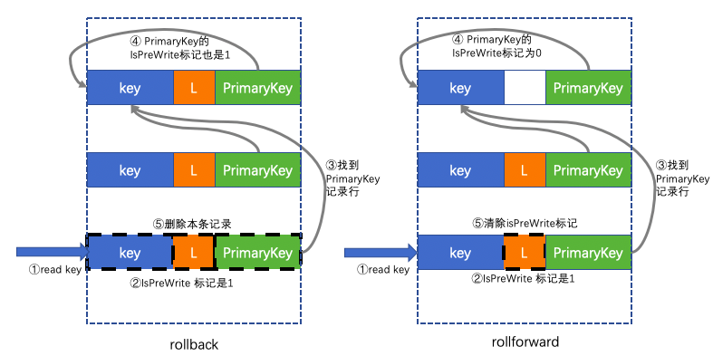
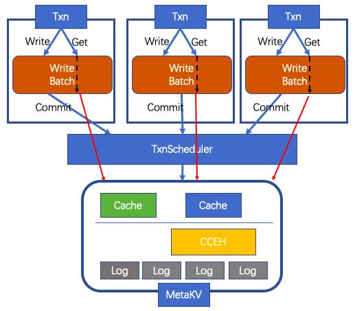
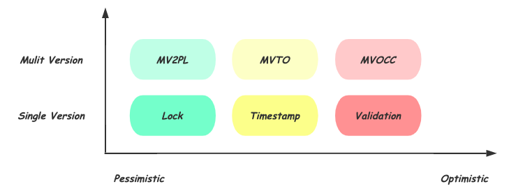

<section id="table-of-contents" class="toc">
  <header>
    <h3>Overview</h3>
  </header>
<div id="drawer" markdown="1">
*  Auto generated table of contents
{:toc}
</div>
</section><!-- /#table-of-contents -->

# MetaKV transaction design

在 `MetaKV` 中设计事务机制，并且使得事务之间的隔离级别达到 `serializable`。

## MetaKV 事务机制性质

- `MVOCC` 并发控制
- `serializable` 事务隔离级别

> Note: 为什么不把 `rocksdb` 的那一套直接搬来给 `MetaKV` 呢？

> 注意到一个重要的区别：在 `rocksdb` 当中一个事务的 `WriteBatch` 可以轻松地实现原子性写入数据库（`WriteBatch` 先写入 `WAL` 持久化后写到 `memtable` 即可，可以理解为 `WriteBatch` 把一系列的 KV 更新操作打包一并写入了（这就是 `LSM-tree` 带来的好处））；但是在 `MetaKV` 中，我们的存储引擎是 `CCEH` 一种哈希索引结构，仅能保证一个事务中的每一个写操作是原子更新的，所以不能直接使用 `rocksdb` 的事务机制

下面将 `MetaKV` 事务机制简称为 `MetaTxn`

### OCC 原理

在 `MetaTxn` 中，每个事务包含一个开始处理的 `start_ts_`（其主要目的就是给各个 `Txn` 加序，在冲突检测的时候认为 `start_ts_` 较小的 `Txn` 应当先完成）。基于传统的 `OCC` 可以将 `MetaTxn` 整个事物的执行分为三个阶段：

1. `Read/Write Phase`：数据准备阶段。每一个事务维护一个 `WriteBatch`，写操作先记录到其中；对于读操作，优先在事务本地的 `WriteBatch` 中进行查找，若不存在再利用 `multiversion` 得到事务中读操作的 key 所对应的 value，不过需要读取的是提交时间戳小于 `start_ts_` 的版本；

2. `Validation Phase`：冲突检测阶段。在内存中维护事务提交的 `read key set` 以及 `write key set`，具体的冲突检测策略将在后面详述；

3. `Commit Phase`：提交阶段。能够进入提交阶段进行写入的多个事务是确认了不会产生 `write-read conflict` 以及 `write-write conflict` 的，所以这样的事务是可以并发写更新到底层 KV 引擎的；

需要说明的是，第三阶段中，虽然写入的冲突问题解决了，但是这样的 `commit` 不能保证原子性，所以 `MetaTxn` 实现基于上述三阶段进行了扩展。

## MetaTxn 实现方案

### key 格式约定

在 `MetaKV` 中为了支持 `MetaTxn`，对 `key` 的数据格式约定为：

> user_key,commit_ts -> isPreWrite,user_value,Deleted,primary_key

各字段定义如下：

- user_key/user_value：记录用户需要存储的键值信息；（`user_key` 与 `user_value` 可以将长度信息编码进去）
- commit_ts：记录一个键值记录被提交时的时间戳，同时借此保存了一个 key 的多个版本；
- Deleted：键删除标志，由删除操作提交时设置
- _isPreWrite_：与故障恢复有关，详见后文
- _primary_key_：与故障恢复有关，详见后文

### MetaTxn Commit 与故障恢复

为了实现故障恢复，`MetaTxn` 将 `OCC` 事务的提交阶段再分解为了两个步骤：

1. PreWrite：从当前事务中的 `write key set` 中选择一个键作为 `primary key`（简单取第一个需要写入的 key 即可）；对 `write key set` 中每一个 key 进行 commit 时，设置对应的 value 中 `isPreWirte` 标志位为 1，`primary_key` 设置为选定的 key + 当前提交事务的 `commit_ts`；

2. Commit：从 `primary_key` 开始对 `write key set` 逐一设置 `isPreWrite` 为 0。完成后认为事务已经完成提交，然后 `MetaTxn` 事务调度器会认为当前事务不再活跃（或者说在后续的冲突检测中不再将当前事务考虑进去）

上述过程本质上是一个两阶段提交。具体的 `rollback` 和 `rollforward` 操作如图所示：



<center>图1.提交崩溃后的恢复策略</center>

需要说明的是，上图中的 key-value 布局是逻辑上的展示，与实际 `MetaKV` 如何物理地存储键值无关，其次图中的 kv 项省去了部分字段。

简单来说，就是利用事务写入时选择的 `primary key` 作为一个同步点。如果系统在删除 `primary key` 的 `IsPreWrite` 标志之前发生了崩溃，说明当前事务的所有更新可能没有完整地同步到底层的 KV，那么要对写记录进行 `rollback`，而 `rollback` 的方式是惰性的，只有当新的读操作访问到指定的 key 时，才会按照图中方式检查并删除一条更新，而读操作会继续查找之前 timestamp 的最新记录，所以不会导致 `读脏`；

类似地，当发现 `primary key` 中的 `IsPreWrite` 没有置位，说明崩溃前事务已经让一部分更新对其他事务可见了，那么，当前的读操作应该清除 `IsPreWrite` 标记，并返回当前记录的值。

使用上述方式带来的好处就是通过惰性的方式避免了恢复时采用 `redo log` 或者 `undo log`。

## MetaTxn Validation

这部分主要阐述 `MetaTxn` 的 `Validation`。假设系统中每个事务能够被赋予全局唯一的事务号，则有事务号 Ti 和 Tj ，且 Ti < Tj，可以将系统内是否存在一个与事务号顺序等价的并发事务调度序列作为可串行化标准，则检查事务Tj是否符合可串行化（即Ti在Tj之前完成），需满足如下三种条件之一：

1. Ti 在 Tj 开始读取阶段前完成写入阶段，即 Ti 在 Tj 之前提交
2. Ti 的写集与 Tj 的读集不相交，且 Ti 在 Tj 开始写入阶段前完成写入阶段
3. Ti 的写集与 Tj 的读集和写集都不相交，且 Ti 在 Tj 完成读取阶段前完成读取阶段

> 条件1：即在某个事务开始之前提交的事务他的所有更新已经提交的数据库，这样的事务对当前事务无影响；

> 条件2：如果 Ti 的写集与 Tj 的读集相交，且 Ti 已经完成写入，Tj 有可能会读取到 Tj 更新之前的脏数据；

> 条件3：如果读集和写集相交，有可能靠后的事务没有读到新版本的值；如果写集和写集相交，因为靠前的事务还没有写，不能保证写入顺序，出现写覆盖，因此也有可能不符合串行化规则；

### MetaTxn 总体结构

`MetaTxn` 总体结构如下图所示：



<center>图2.MetaTxn总体结构</center>

### 结构体定义

需要说明的是，为了清晰，结构定义的代码采用了 `C++` 的展示方式，实际实现中采用的是 `C` 实现。

Txn：

```c++
enum TxnStatus {
  INCOMPLETE = 0,   // Not yet executed
  COMPLETED_C = 1,  // Executed (with commit vote)
  COMPLETED_A = 2,  // Executed (with abort vote)
  COMMITTED = 3,    // Committed
  ABORTED = 4,      // Aborted
};

struct Txn {
    TxnStatus status_;
    double start_ts_;

    set<Key> readset_;
    set<Key> writeset_;

    // Results of reads performed by the transaction.
    map<Key, Value> read_res_;
    // Key, Value pairs WRITTEN by the transaction.
    map<Key, Value> write_batch_;
};
```

`Txn` 负责构建内存中的 `write_batch` 结构，实现一个私有空间下的读写操作接口。用户通过调用 Txn::Get 方法向事务的 `read set` 中加入并利用 `write_batch` 和 `MetaKV` 的多版本读出数据，并将读取结果放入 `read_res_` 以便 `Txn` 在成功 commit 后把数据返回给用户，使用 Txn::Write 则仅仅只是向 `write_batch` 加入更新的 KV。

TxnScheduler：

```c++
struct TxnScheduler {
    MetaKV *db_;
    ThreadPool threads_;
    // Queue of incoming transaction requests.
    // AtomicQueue<Txn*> txn_requests_;
    // Queue of completed (but not yet committed/aborted) transactions.
    AtomicQueue<Txn*> completed_txns_;
    // Queue of validated transactions that are ready to be committed/aborted
    AtomicQueue<pair<Txn*, bool>> validated_txns_;
    // Queue of transaction results (already committed or aborted) to be returned to client.
    AtomicQueue<Txn*> txn_results_;
};
```

在 `TxnScheduler` 中，调度各个 `Txn`，负责冲突检测。其核心算法就是 MetaTxn Validation 阐述的内容。

## 总结

数据库事务的并发设计方案，在目前来讲，大的方向有3种，本质的区别就在于判断冲突的时机：

1. `2PL`，两阶段锁，悲观事务机制，利用 `X-lock`， `S-lock` 等机制实现，在事务开始前进行冲突检测；
2. `TO`，基于 timestamp，一般会维护事务的开始时间和提交时间戳（可能类似 `Percolator`），在事务执行过程中进行冲突检测；
3. `OCC`，基于 Validation Phase，在 commit 前进行冲突检测；

另外，3者可以在多版本并发的基础上实现相应的并发控制方案，以上技术的分类可以用下图表示：



<center>图3.并发控制方法分类</center>

方案最终采用 `OCC` 的原因如下：

- 首先放弃了 2PL，因为加锁的悲观事务机制往往需要死锁检测，增加实现的复杂度；
- 考虑到 `MetaKV` 通常是小规模事务；
- `MetaKV` 管理的文件元数据一般是重读负载；

## 后续

- 目前使用的 OCC 算法，采用的还是1981年论文 _On Optimistic Methods for Concurrency Control_ 给出的做法，更先进和优秀的算法尚未调研；
- 考虑与 MetaKV 接口对接的相关问题；
- 实现并测试；
