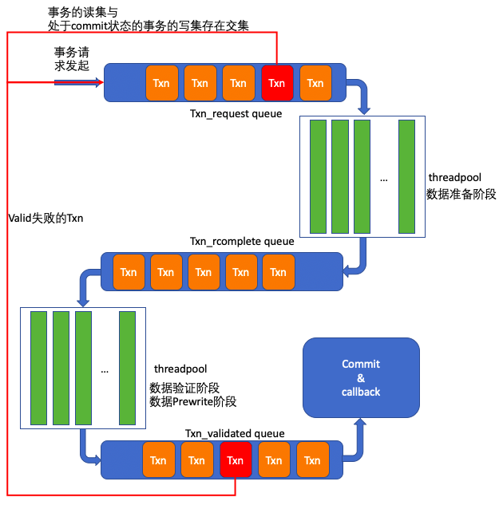
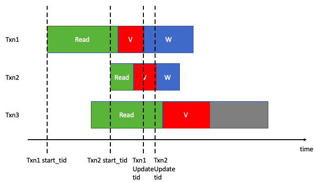
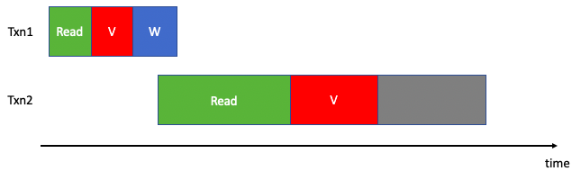
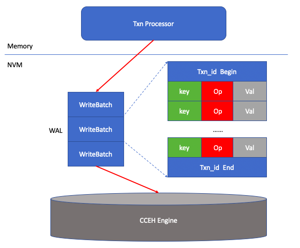
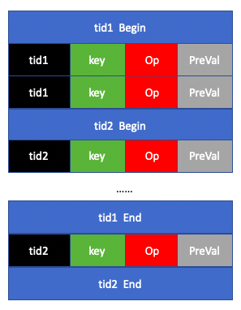

<section id="table-of-contents" class="toc">
  <header>
    <h3>Overview</h3>
  </header>

*  Auto generated table of contents
{:toc}

</section><!-- /#table-of-contents -->

## 需求分析

事务的设计有如下基本的约束条件：

- 在执行完 `txn::commit` 之后，并且认定事务成功 commit 的情况下，最新的修改应当已经持久化。（即事务需要提交必须先持久化）保证 `ACID` 中的 `D`；

- 事务在写入过程中需要持久化数据，如果此时系统发生崩溃，一个事务可能部分持久化了更新，所以需要一些机制来保证 `ACID` 中的 `A`；(这里的 `A` 特指为写入更新时的原子性)；

- `C` 和 `I` 则由事务机制进行保证；

相比于之前的多版本事务并发控制，单版本的设计主要存在如下两个问题：

1. 之前利用多版本，在每一个数据记录中添加一个 `IsPrewrite` 标记以及惰性删除标记的方式实现了提交的故障原子性。现在在单版本下，方案将基于传统的 `undo log` 来实现。

2. 另外，由于不使用多版本，所以在读操作进行的时候无法保证读看到的视图是一致的，即可能读取到的 `read set` 处于被其他事务部分更新的状态下。

## 新设计

### key-value format

> map-1：<`key`>-<`value`> 
> map-2：<`key`>-<`update_tid`>

map-1 保存了原始的 kv 映射，map-2 保存了每一个 key 被最后一次修改的事务 id。

实现中可以将两个表合并为 <`key`>-<`value`>+<`update_tid`>，主要是为了更方便地保证一条 kv 记录的修改原子性。分开成两个表导致更新一项 kv 记录变成两次查表更新操作，需要更多的开销以及同步操作来避免其他事务看到不一致的部分更新状态。

### 事务处理流程

每一个事务进入 `Txn_request queue` 时会获得一个全局唯一且单调递增的 `start_tid`；当事务进入数据验证阶段并验证成功之后，在开始 `Prewrite` 阶段会申请一个全局唯一且单调递增的 `update_tid`；实现中，`Txn_request queue`、`Txn_rcomplete queue` 以及 `Txn_validated queue` 是在一个线程下进行操作的，该线程是一个主循环过程，依次轮询三个队列，取出队列中的事务交由线程池中的线程进行处理，所以事实上事务依然还是并发执行的，并没有降低事务的并发度；

在设计上，继续采用的 `OCC` 乐观并发控制，从流程图上可以清楚地看到处理过程被分为了数据准备阶段（`READ`）、数据验证阶段（`validation`）以及数据提交阶段（`commit`）。

与多版本事务并发设计主要不同的区别在于数据验证阶段和数 据提交阶段，故下面对这两部分进行详细介绍。

### validation 流程

描述 `validation` 流程，需要首先阐明关于事务生命周期的几个重要时间节点：

- `start_tid` 事务处理的准备阶段开始
- `update_tid` 事务开始 `commit` 阶段
- `active` 期：从 `validation` 阶段开始到 `commit` 阶段结束

#### 具体流程

下面介绍具体流程：

1. 当前处理的事务 `txn` 对其读集 `read_set` 中的每一个 `key` 检查是否满足：`key` 的 `update_tid` 比事务的 `start_tid` 要小。如果不满足，则说明在处理这个事务之前已经有一个并发事务至少进行到了 `Prewrite` 阶段（进入 `Prewrite` 状态的事务只要不系统发生崩溃必定能提交成功），当前事务的读集得到的读结果有可能是该事务修改之前情况，导致该事务更新丢失；

2. 当前处理的事务 `txn` 对其写集 `write_set` 中的每一个 `key` 检查是否满足：不存在在此时进入 `validation` 阶段的所有事务的 `read_set` 以及 `write_set` 中。

#### 正确性论证

下面来论证依靠上述流程能够保证读操作能够看到一致的数据库视图：

要让读操作存在看到不一致视图的可能，就需要让该读事务处于数据准备阶段过程中有其他事务已经进入了 `Commit` 阶段（或者说 `Write` 写回阶段，在下图中采用了 `W` 来表示）

对于 `Txn1` 和 `Txn3` 来说，如果在 `Txn3` 准备数据的过程中 `Txn1` 对于两者存在交集的 key 进行了修改，那么根据 `Validation` 流程1，`Txn3` 会读到某项 kv 记录的 `update_tid` 标记比自己的 `start_tid` 要大，就会判断为 invalid 然后发生 abort；当然，也可能 `Txn3` 在读取数据过程中并没有察觉到 `Txn1` 已经将数据进行了更新，那么此时 `Txn3` 读取到的数据视图至少是 `Txn1 start_tid` 之前的，而 `Txn1` 读取的数据视图在这种情况下可能与 `Txn3` 的是一致的，如果允许 `Txn3` 执行，那么可能导致 `Txn1` 的更新丢失，这一点通过 `Validation` 流程2保证了。

`Txn2` 是导致后续事务读取到不一致视图的另一种可能，不过其原理和 `Txn1` 类似，这里不再赘述。

- 如下是唯一可能会导致读视图不一致的情况：

在这种情况下，由于 `Txn1` 的 `commit` 阶段在 `Txn2` 的开始阶段之前开始，导致即使 `Txn1` 的数据部分写入，`Txn2` 也无法察觉，即会出现读脏数据的情况。这种问题在之前的多版本中并不会出现，其主要原因如下：

1. 首先多版本中只能看到某个时间戳之前的数据库状态，屏蔽了发生在 `Txn2` 之后的更新；
2. 对于上图情况，在多版本中通过 `Primary key` 和 `isPrewrite` 标记的方式让 `Txn2` 也无法通过检查；

不过，事实上，通过事务处理流程图当中已经给出了解决方案：

在数据准备阶段前，事务处理器会检查即将调度的事务的读集是否与处于 `commit` 状态的事务的写集存在交集，如果存在则会将该事务加回队列尾部，等待下一次的调度；虽然这种方式一定程度上降低了事务处理的乐观性，但是这种情况需要事务提交异常缓慢且冲突量较大的时候才会发生，故目前采用了这种设计。

对于原子性提交，在修改 `validation` 流程的基础上引入了两种方案：

1. 事务在 `commit` 阶段将修改写入 `WAL`，`CCEH` 存储引擎从 `WAL` 读出更新完成后续写入，本质上形成了内存、`WAL`、`CCEH` 的多层级存储；
2. 引入 `undo log` 在故障之后恢复数据库一致性状态；

下面分别介绍两种方案，并分析其优劣。

### WAL 机制

方案一总体结构图如下所示：

`WAL` 需要具备的设计限制如下：

- 写入的原子性粒度需要以 `WriteBatch` 为单位；

`WAL` 的设计方法，总的来说就是把 `CCEH engine` 部分不支持的批量更新原子写入功能，转移到 `WAL` 上

#### 主要的问题

- `WriteBatch` 是逻辑上的且物理大小不定，很难利用 NVM 更新的原子性单位来实现以 `WriteBatch` 为单位的更新，不可避免地要使用内存中的同步机制；

- `WAL` 与 `CCEH engine` 形成的多层级存储结构，进行读操作时，`WAL` 在不外加其他的索引结构前很难提供高效的读效率，而外加其他索引结构会提高设计复杂度；

### undo log

`undo log` 也建立在 NVM 上，`undo log` 中记录事务更新的记录项的原始值，具体结构如下所示：

需要区别的是，不同于 `redo log` 使用 `undo log` 不需要其本身支持原子性写入单位为 `WriteBatch`，而只需要保证每一项记录写入的原子性即可，所以 `undo log` 的记录在上图当中呈现出一种乱序的状态（注意是 `txn` 之间的乱序，同一个 `txn` 中的各个修改还是保持顺序的）。

在事务的 `commit` 阶段，首先向 `undo log` 写入逆向操作以及旧数据记录，然后再向 `CCEH engine` 写入数据。

而在系统崩溃之后回滚部分提交的事务时，在系统重启时需要逆序地读取 `undo log`，找到并没有 `tid End` 存在的 `tid` 相关记录，然后按照记录内容执行对 `CCEH engine` 状态的修改。考虑到 `undo log` 会增长地很大，而逆序读取 `undo log` 无法确定哪一个事务是最后一个部分提交中的，所以引入 `checkpoint`，每隔一定的成功提交的事务数量，在事务处理流程的最后一步————从 `validated queue` 中弹出事务对象时，获取当前处于 `commit` 状态的事务集合 { `Txn1`, `Txn2`,..., `TxnN`}，在 `undo log` 中记录下如下格式记录：

> checkpoint-<`Txn1`>-<`Txn2`> ... <`TxnN`>

并在 log 头位置更新最新的 checkpoint 记录的位置，那么在恢复时只需要定位到 checkpoint 位置，从 log 尾部逆序扫描到 checkpoint 中的 `Txn` 集的最后一个 `Begin` 记录位置处即可（并且，如果前后两次进行 checkpoint，其记录的 `Txn` 集合不存在交集，则可启动 `GC` 回收前一个 checkpoint 之前的空间）

#### 主要问题

TODO