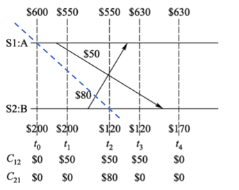
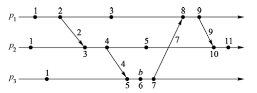
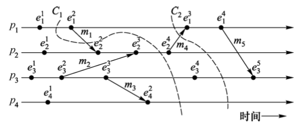
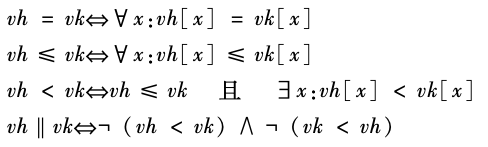
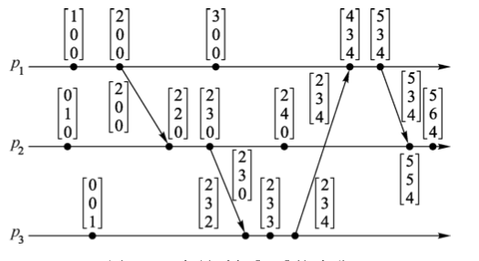
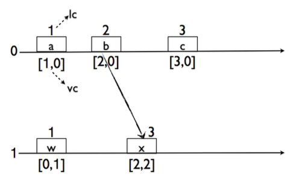
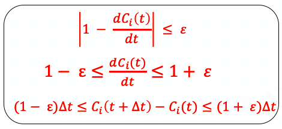
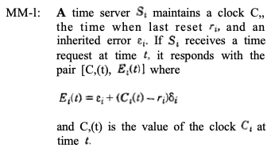
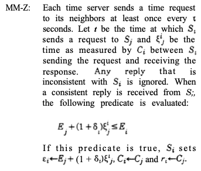
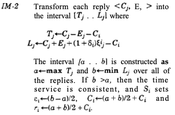

<section id="table-of-contents" class="toc">
  <header>
    <h3>Overview</h3>
  </header>

*  Auto generated table of contents
{:toc}

</section><!-- /#table-of-contents -->

## HLC

### 出发点

分布式理论中的逻辑时钟概念在分布式事件因果关系的基础上建立，基于 `Lamport happened before` 关系，利用逻辑时钟的抽象形式化地给出了分布式事件因果、并行等关系的定义，但是无法反映出事件在实际时间上的先后关系；而在生产实际中，通常使用的是物理时钟，由于物理时钟与精准时钟存在偏差，导致在各个节点上需要进行时钟同步。

为了调和以上两者之间的 gap，HLC 应运而生，它结合了逻辑时钟和物理时钟的优势:

> HLC captures the causality relationship like logical clocks, and enables easy identification of consistent snapshots in distributed systems.

HLC 继承了逻辑时钟的性质，能够清晰地包含事件之间的因果关系，同时能够轻松地识别 “一致性的系统快照”（为什么逻辑时钟很难获得一致性的系统快照呢？这里引用 `分布式计算原理、算法与系统` 中关于全局一致性快照一章的部分内容）

在上图中，由于使用逻辑时钟，如果没有采用基于逻辑时钟的分布式快照算法，那么就不能保证 `S1` 和 `S2` 在相同的实际时间下对自己进行快照操作（在图中用纵向的虚线表示）。比如 `S1` 在 t0 时进行了自己的快照记录下 `$600`，而 `S2` 在 t2 时记录自己的快照 `$120` 以及此时的信道状态 `$50` 和 `$80`（`Note`: 分布式一致性快照包含信道状态），这两者组成的一个全局快照得到了总额为 `$850` 的非一致结果。

而且，虽然采用基于逻辑时钟的分布式时钟算法能够避免上述非一致状态的问题，但是依然存在问题：

比如在上图中，一个可能的基于逻辑时钟的分布式快照由图中蓝线展示，此时快照为：`S1`：`$600`，`S2`：`$120`，`C12`：`$0`，`C21`：`$80`；但是并不存在一个实际时间意义下的快照（图中纵向虚线）与这种快照对应。

### 性质

- 能在一定精度与 `NTP` 保持同步
- 适合于 64 为 `NTP` 时间戳格式
- 基于 `HLC` 可实现无等待分布式事务

### Brief history of time

| LC | VC | PT | TT | HLC |
|:---|:---|:---|:---|:---:|

#### 逻辑时钟

##### LC

在论文中提到，一维的逻辑时钟即 `Lamport Logic Time`，在确定一个一致性快照的时候采用如下方式：

> LC finds one consistent snapshot (that with same LC values at all nodes involved)

对这一结论进行简要的说明：

首先有以下引理：

> 若事件 `e1` 因果先于 `e2`（表示为 `e1` -> `e2`），那么 `L(e1)` < `L(e2)`（需要说明的是反过来并不成立，用术语来说 `Lamport Logic Time` 是一种一致性时钟，但是并没有达到强一致性，强一致性需要两者等价）

基于上述引理，容易得到：

> 若 `L(e1)` == `L(e2)`，那么事件 `e1` 和 `e2` 并行（表示为 `e1||e2`）

反证法：假设 `L(e1)` == `L(e2)`，且 `e1` 和 `e2` 存在因果关系，那么必然存在一条从 `e1` 到 `e2` 的路径（通过上图，从图论的视角看可以发现每一个节点上的某个事件的逻辑时间实际上是从各个节点的初始事件出发的最大路，最大路径具有最优子结构），那么推出 `L(e1)` != `L(e2)`；

一致性快照的定义事实上具有一个非常严格的形式化描述，限于篇幅，给出一个一致性快照和一个非一致快照的图例，并用自己的语言一句话说明一致性快照的本质要求：

图中 `C2` 划分是一个一致性快照，而 `C1` 是一个非一致快照，一致性快照的本质要求就是不能存在一个从快照的 `FUTURE` 到 `PAST` 传递的消息。

回到论文中的论断，也即选择逻辑时钟一致的事件作为一致性快照，实际上是选择了多个并发的事件，假设这种快照下存在一个从快照后到快照前的消息传递，那么就必然存在一个从较大逻辑时钟向较小逻辑时钟传递的消息，显然和 `Lamport logic clock` 算法矛盾；

##### VC(向量时钟)

不同于 `LC`，`VC` 的一个重要性质就是满足强一致性，`VC` 之间的定义的比较关系如下：

`VC` 满足强一致性说明 `VC(e1) < VC(e2)` 和 `e1->e2` 等价。

我们再次从图论的角度来理解，这一次某一个节点上的事件 `e` 的向量时钟实际上记录的是每一个节点上与 `e` 存在着因果关系的最大本地事件编号，比如上图中 `P1` 的第四个事件向量时钟 `[4,3,4]` 表示和 `P1` 的第四个事件、`P2` 的第三个事件、`P3` 的第4个事件存在因果关系（自然的，各个进程上较小的事件也和 `e` 存在关系，本质上仅仅靠一个向量的信息，我们就能知道这个事件 `e` 的 `PAST` 事件集合）。

关于 `VC` 的一致性快照论文中举出了一个例子，如下图所示：

> In Figure 1, while LC would find (a,w) as a consistent cut, VC would also identify (b,w), (c,w) as consistent cuts.

根据在 `LC` 部分的分析，我们知道选取集群中互相并行的事件可以组成一个合法的一致性快照，再根据 `VC` 的偏序关系比较定义，容易得到 (a,w)/(b,w)/(c,w) 是并行对，自然满足一致性快照的要求。

所以 `VC` 和 `LC` 本质上的区别是 `VC` 承载了比 `LC` 更多的信息：

1. `LC` 只知道因果事件链最大链上的事件数量，而 `VC` 知道有多少事件和自己存在因果关系；
2. `VC` 知道自己的 `PAST` 事件集合，而 `LC` 未知；
3. `VC` 之下事件满足全序关系，而在未扩展的 `LC` 中事件仅仅是偏序关系；

> Note: 其实 `HLC` 本质上就是一个特殊的 `VC`

#### PT(物理时钟)

物理时钟相对于逻辑时钟来说，能够通过同步反映系统与实际时间相匹配的事件顺序。其缺点如下：

- 存在不确定区间（`uncertainty intervals`），如果两个物理时钟标记的不确定区间发生的重叠就很难区分两者的先后顺序；
- 闰秒等问题；（应该是就使用 `NTP` 做同步的方式而言的）

##### Marzullo 算法

> 相关算分细节以及正确性证明限于篇幅，在本文中不做详述，请查阅论文 `Maintaining the Time in a Distributed System`

简单的 `NTP` 服务进行物理时钟同步的方式完全忽略了这个问题的复杂性，`Marzullo` 算法对物理时钟同步进行了形式化的建模，提出两种同步算法（`Minimization of the Maximum Error` 以及 `Intersection` 方式）并通过形式化证明了在该算法下 `uncertainty` 的有界性。

在 `Marzullo` 论文中，各个节点上的本地时钟被描述为一个关于实际时间 `t`（一个逻辑上绝对精确的时钟）的函数 `C(t)`；为了描述本地时钟和实际时钟产生差异的原因，引入了 `𝜀`，来描述与实际时钟（形式化上讲，即满足 `C(t) = t` 的时钟）频率之间漂移的上限，具体定义以及 `𝜀` 与 `C(t)` 的关系如下图所示：

而后定义了误差 `E(t)` 的概念，表示了在实际时间 `t` 时，在某节点上的误差（注意这个误差只是节点时钟自身的一种属性，并不是相对实际时间的误差，因为节点时钟显然是无法知道当前精确的实际时间的）；一个合法的物理时钟的要求为 `C(t) - E(t) <= t <= C(t) + E(t)`。

同样地，因为节点无法知晓当前的精确实际时间，所以 `Marzullo` 算法实际上是归纳意义下的算法，即初始化时各个节点的时钟都满足合法要求，`Marzullo` 算法归纳地保证后续过程中该节点的时钟依然合法。

`Marzullo` 算法分为两个部分，第一部分决定在不发生节点间通信时，本地的 `E(t)` 如何随时间变化，如下图所示：

`MM-1` 说明一个不与其他节点进行通讯的时钟服务器，其时钟的误差 `E(t)` 会与本地时间间隔成线性关系增加。这是符合直觉的（当然合法性的证明也比较容易，详见论文，这里不做赘述）。

正因为不参与通信的服务器的时钟会随着时间流逝出现很大的 `uncertainty`，所以 `Marzullo` 算法的第二部分就是解决如何在通信时减小 `uncertainty`。论文中采用两种不同的策略：

- `Minimization of the Maximum Error`，简单来说就是在通信过程中从其他节点中“学习”较小的 `E(t)`；

- `Intersection` 方式，和上一种方式的差别，主要是从其他节点中“学习”较小 `C(t) + E(t)` 以及较大的 `C(t) - E(t)` 从而最终获得一个总体上较小的 `E(t)`；

从直觉上来讲，方法2能够获得比方法1更小的 `E(t)`。在论文中给出了较详细的形式化证明。

